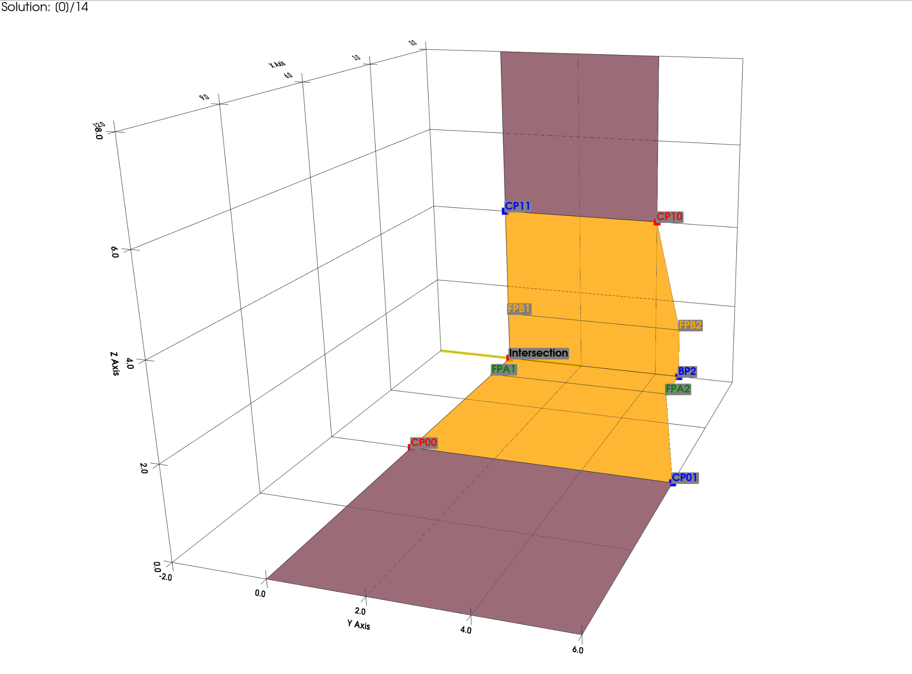
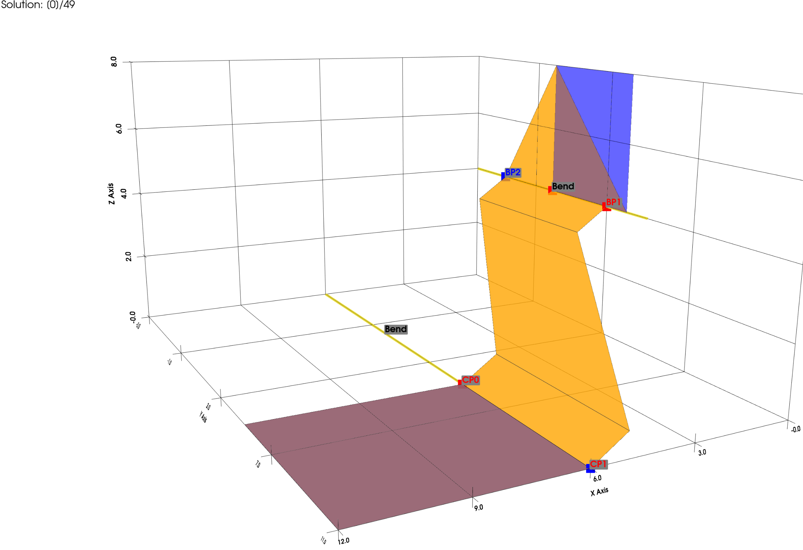
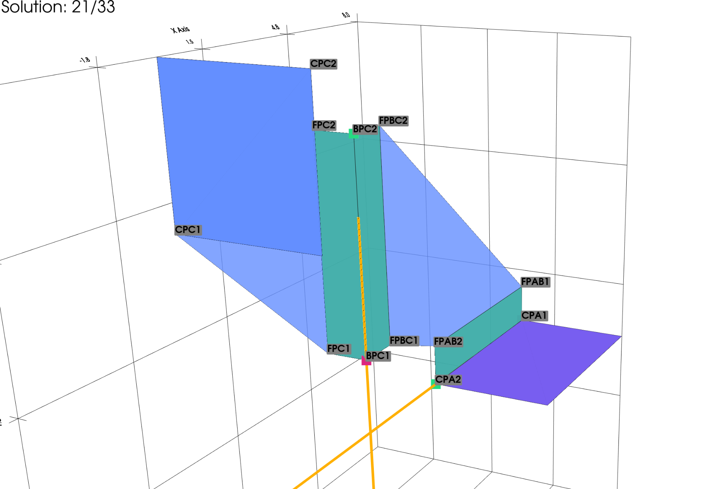
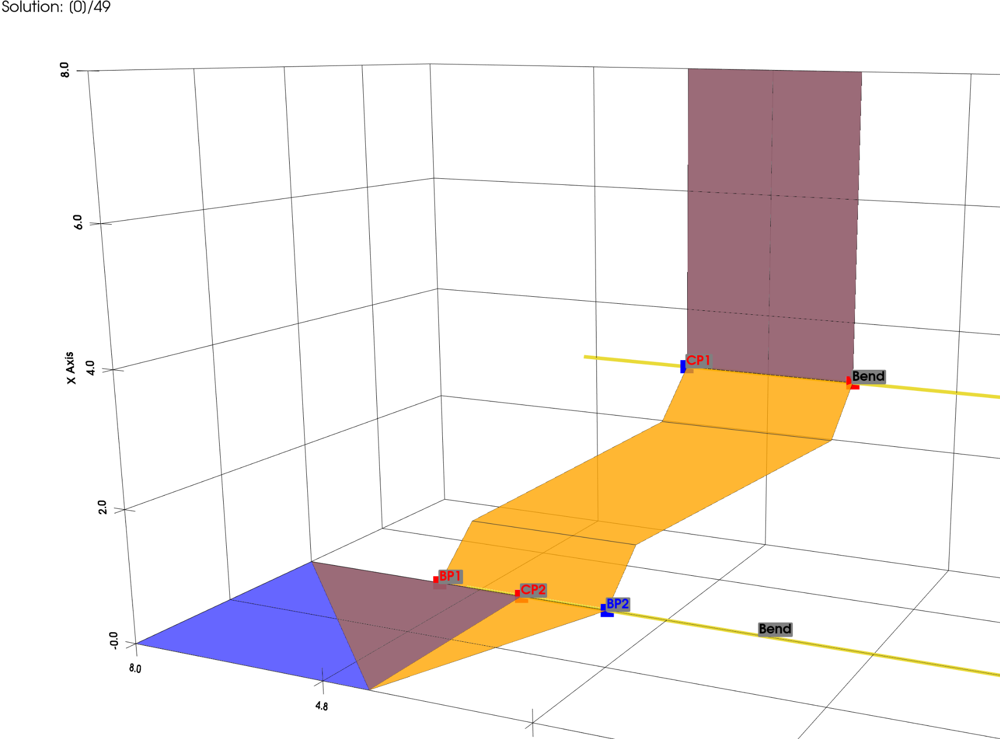

  
  

  
  

THIS PROJECT IS STILL UNFINISHED!

# How it works
The user gives two rectangles as an input, and the program tries to find different ways to connect those two rectangles in way, that is manufacturable. Solutions are generated in two ways. Either by finding the intersection of the two planes and connecting them, or by selecting 2 points from one rectangle and 1 point from the other, and creating an additional tab on that plane.

# How to install it

0. Optional: Activate virtual environment with "source venv/bin/activate"
1. Install dependencies
2. run "pip install -e ."

# How to use it

In user_input.py you can provide the input values you want.
In config.yaml you can configure what should get plotted.

# Explanation of Abbreviations

- BP = Bending Point
- CP = Corner Point
- FP = Flange Point

- _A  = Part of Tab A
- _AB = Connect Tab A and B

- _0 = Middle
- _1 = Side 1
- _2 = Side 2

# Development Goals

- [x] Generate solutions for 1 bend
- [x] Generate solutions for 2 bend
- [x] Improve flange visuals
- [ ] Filter solutions that are unsuitable
- [ ] Minimum distance from bend
- [ ] Introduce mounts
- [ ] Extend to multiple squares
- [ ] Generate solutions by separating surfaces

- [ ] Extend installation guide
- [ ] Explain function more precisely