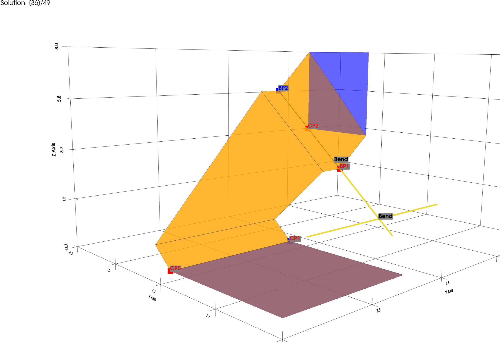

  
  

  
  

THIS PROJECT IS STILL UNFINISHED!

# How it works

# How to install it

0. Optional: Activate virtual environment with "source venv/bin/activate"
1. Install dependencies
2. run "pip install -e ."

# How to use it

In user_input.py you can provide the input values you want.
In config.yaml you can configure what should get plotted.
