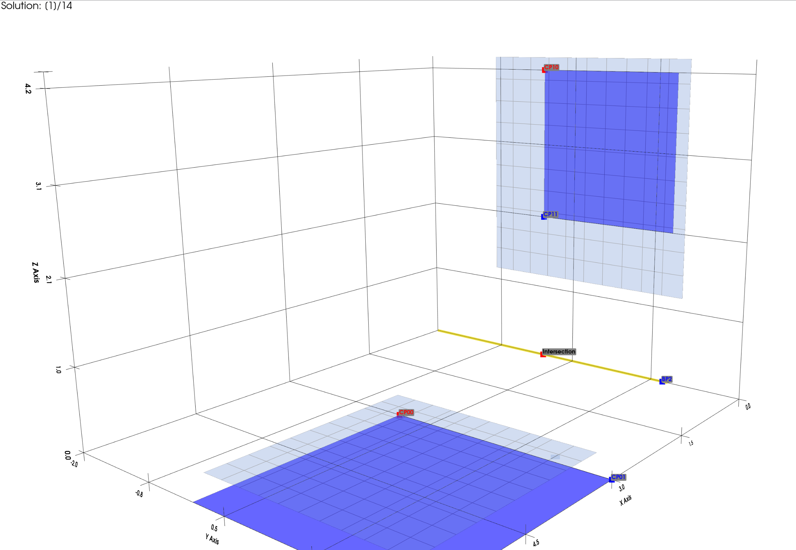

# How it works

# How to install it

1. Install dependencies
2. pip install -e .

# How to use it

In user_input.py you can provide the input values you want.
In config.yaml you can configure what should get plotted.
